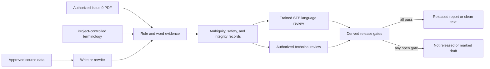

# asd-writing

`asd-writing` contains the Codex skill `write-asd-ste100`. It helps trained teams write, rewrite,
review, and assemble evidence for ASD-STE100 Simplified Technical English Issue 9 work.

The skill is fail-closed: it can prepare drafts and evidence, but it permits the strongest status
and clean output only after complete content-bound checks and actual language and technical
reviewer approvals. It is not ASD-approved, STEMG-approved, or certified.

## Required local reference

The public repository does not distribute ASD-STE100. Obtain an authorized Issue 9 copy through
your organization and place it at:

```text
write-asd-ste100/references/asd-ste100-issue-9.pdf
```

The expected digest is recorded in `references/compliance-checklist.yaml`. A clone without the
authorized local file is intentionally non-operational for compliance release.

Do not commit or redistribute the PDF. The tracked `.gitignore` protects this path in each clone.

## Workflow



Task mode (`write`, `rewrite`, or `review`) is independent from output mode (`report`, `teaching`,
or `clean`). The scripts generate starter ledgers and validate deterministic evidence; they do not
decide language meaning, prove reference authorization or reviewer identity, or replace human
judgment.

## Validate the repository

From the repository root:

```text
python -m unittest discover -s tests -v
python -m ruff check write-asd-ste100/scripts tests
python write-asd-ste100/scripts/create_compliance_report.py --verify-skill-root write-asd-ste100
```

Run the standard Codex skill validator too:

```text
python <SKILL-CREATOR>/scripts/quick_validate.py write-asd-ste100
```

## Install locally

Install only after the authorized PDF is present and every validation succeeds. Copy the complete
`write-asd-ste100` directory to the local Codex skills directory, preserving the PDF locally. Then
verify byte-for-byte parity:

```text
python write-asd-ste100/scripts/create_compliance_report.py --verify-skill-root write-asd-ste100 --compare-skill-root <CODEX-SKILLS>/write-asd-ste100
```

Generate a fail-closed evidence starter, complete word ledger, and applicable-check index through
the two bundled scripts. See `write-asd-ste100/SKILL.md` for the exact commands and release
workflow.

For a durable audit artifact, add `--output-dir <REPORTS>` to the report command. The command writes
digest-qualified JSON and Markdown files through atomic sibling-file writes. It refuses to replace
an existing report unless `--overwrite` is explicit.

Use the JSON fields `state_code`, `operation_succeeded`, and `release_permitted` for agent
orchestration. `operation_succeeded` means that report validation completed. It does not authorize
release. Use `release_permitted` for that decision, and do not infer release from the process exit
code or from the presence of a report file.

## Security, privacy, and limitations

- Keep proprietary, export-controlled, personal, customer, and safety-sensitive source material in
  organization-approved local systems and tools.
- Do not commit source documents, terminology approvals, reviewer identities, compliance reports,
  or the authorized standard unless their owner explicitly permits it.
- Reviewer records are consistency-checked and bound to an artifact digest, but the script cannot
  authenticate a person or establish their qualifications.
- File identity proves only that bytes match the configured manifest. It does not prove that an
  organization is authorized to possess or use the standard.
- Automated evidence gates prevent known omission and consistency failures. They do not guarantee
  linguistic compliance or technical accuracy.
- Long documents must be checked in stable sections and reconciled into one complete final token,
  rule, terminology, safety, integrity, and reviewer evidence bundle.
